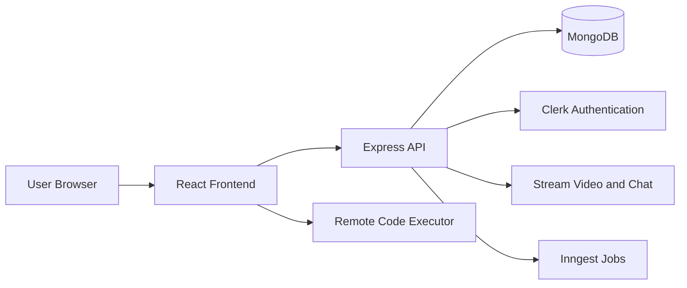

# Online Judge System Project Report

## 1. Project Overview
Online Judge System is a full-stack interview and online coding practice platform. It combines real-time video communication, collaborative session management, a code editor, and problem-solving workflows into one web application.

The project is organized as a monorepo with a Node.js/Express backend and a React/Vite frontend. Authentication is handled through Clerk, live calls and messaging are powered by Stream, and background work is integrated through Inngest.

## 2. Project Objectives
The main goals of the project are:

- Support one-on-one coding interview sessions.
- Allow users to solve coding problems in a browser-based editor.
- Provide live video and chat communication during sessions.
- Track active and recent sessions for each user.
- Execute code securely through an isolated remote execution service.
- Provide a clean dashboard and practice environment for solo learning.

## 3. Technology Stack

### Frontend
- React
- Vite
- React Router
- Clerk React SDK
- TanStack Query
- Stream Video React SDK
- DaisyUI / Tailwind-style utility classes
- react-resizable-panels
- react-hot-toast
- canvas-confetti

### Backend
- Node.js
- Express
- MongoDB with Mongoose
- Clerk Express middleware
- Stream server SDKs
- Inngest
- CORS
- dotenv

## 4. System Architecture
The system follows a typical client-server architecture:

The frontend is responsible for routing, UI rendering, and interaction with the API. The backend manages session persistence, authorization, Stream room setup, and session lifecycle events.

## 5. Main Features

### 5.1 Authentication
Users sign in through Clerk. The app protects dashboard, problem, and session routes so only signed-in users can access them.

### 5.2 Dashboard
The dashboard shows:

- Active sessions
- Recent completed sessions
- Session statistics
- Entry points for creating new interview rooms

### 5.3 Interview Sessions
Users can create a session by selecting a problem and difficulty level. The backend creates:

- A MongoDB session record
- A Stream video call room
- A Stream messaging channel

The host can end the session, which closes the Stream call and chat channel and marks the session as completed.

### 5.4 Real-Time Video and Chat
Session participants join a shared Stream-powered environment for live video and text chat. The backend issues a Stream token for the authenticated user and adds them to the correct channel.

### 5.5 Coding Workspace
The session screen includes:

- A problem description panel
- A resizable code editor
- An output panel
- Live call and chat on the same page

### 5.6 Solo Practice Mode
The problems page allows users to practice independently. It loads a problem, lets the user write code, runs it through the execution service, and checks the output against the expected result. Success triggers feedback and confetti.

## 6. Backend Structure
The backend is split into focused modules:

- `src/server.js` starts the Express server, configures middleware, and registers routes.
- `src/routes/chatRoutes.js` exposes a token endpoint for Stream chat access.
- `src/routes/sessionRoute.js` handles session creation, listing, joining, and ending.
- `src/controllers/sessionController.js` contains the session business logic.
- `src/controllers/chatController.js` generates Stream tokens for authenticated users.
- `src/models/Session.js` defines the MongoDB schema for coding sessions.

The session schema stores the problem name, difficulty, host, optional participant, call ID, and status.

## 7. Frontend Structure
The frontend is organized around pages and reusable components:

- `src/pages/HomePage.jsx` presents the marketing landing page and sign-in entry point.
- `src/pages/DashboardPage.jsx` shows session activity and room creation controls.
- `src/pages/SessionPage.jsx` combines the editor, session metadata, video call, and chat.
- `src/pages/ProblemPage.jsx` provides solo practice with automated output checking.
- `src/components/` contains UI pieces such as the navbar, stats cards, session lists, code editor, and output panel.
- `src/hooks/` contains data-fetching and Stream client hooks.
- `src/data/problems.js` stores the coding problem set and starter code.

## 8. Key Request Flows

### 8.1 Create Session Flow
1. A signed-in user selects a problem and difficulty.
2. The frontend sends a create-session request.
3. The backend writes a session to MongoDB.
4. The backend creates the Stream call and messaging channel.
5. The user is redirected into the new session room.

### 8.2 Join Session Flow
1. A user opens an active session.
2. The frontend fetches session details.
3. If the user is not already host or participant, the backend adds them as participant.
4. The Stream chat channel is updated with the new member.

### 8.3 End Session Flow
1. The host ends the session.
2. The backend deletes the Stream call and chat channel.
3. The session status changes to completed.
4. Participants are redirected away from the session page.

### 8.4 Solo Problem Flow
1. The user opens a practice problem.
2. Starter code is loaded for the selected language.
3. The user runs the code through the execution service.
4. The app compares the output against the expected result.
5. Feedback is shown in the UI.

## 9. Setup Summary
The project uses environment variables for backend and frontend configuration. The existing README indicates support for:

- MongoDB connection details
- Clerk publishable and secret keys
- Stream API keys
- Inngest keys
- API and client URLs

The repository scripts support installing dependencies, running the backend in development mode, and building the frontend for deployment.

## 10. Conclusion
Online Judge System is a well-scoped interview practice platform that brings together authentication, live collaboration, code execution, and session tracking. Its modular split between backend services and frontend workflows makes it suitable for technical interviews, pair programming, and coding practice.

If you want, this report can be expanded into a formal academic format with abstract, objectives, methodology, results, and future scope sections.